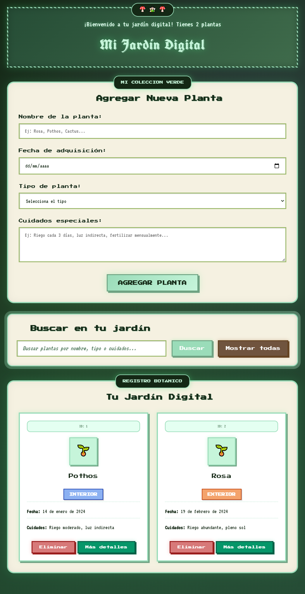

# 🌿 Mi Jardín Digital

**Mi Jardín Digital** es una aplicación web interactiva que permite registrar, visualizar y gestionar una colección de plantas personales. La persona usuaria puede ingresar información sobre sus plantas, almacenarla de forma persistente en el navegador y consultar imágenes relacionadas a través de una API externa.

El proyecto está desarrollado con tecnologías web estándar y presenta una estética inspirada en un entorno natural, utilizando una paleta suave basada en colores de bosque.

## ✨ Funcionalidades

- Formulario para el registro de plantas, con campos como nombre, fecha de adquisición, tipo y cuidados especiales.
- Validación de datos ingresados para asegurar la integridad del registro.
- Almacenamiento persistente utilizando `localStorage`.
- Lectura inicial de datos desde un archivo `.js` con una estructura tipo JSON simulando una base de datos.
- Posibilidad de agregar nuevos registros a la estructura ya existente.
- Visualización de la información mediante tarjetas dinámicas y una interfaz amigable.
- Búsqueda de registros por nombre, tipo o cuidados.
- Eliminación individual de registros.
- Consulta a una API externa para obtener imágenes asociadas a cada planta.

## 🛠️ Tecnologías utilizadas

- HTML5  
- CSS3  
- JavaScript  
- API externa para imágenes de plantas  
- `localStorage` para almacenamiento local

## 📸 Captura de pantalla

